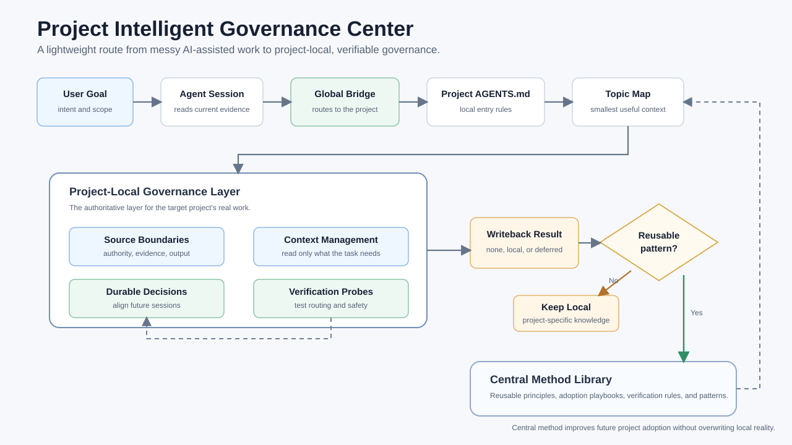

# Project Intelligent Governance Center

[简体中文](README.zh-CN.md)

Project Intelligent Governance Center is a reusable, documentation-authoritative method for making AI-assisted project folders easier to understand and safer to modify.

It helps an agent inspect a project from local evidence, identify source boundaries, preserve useful project-specific practices, avoid copying private or stale context, and write durable knowledge back to the right place.

## Why It Exists

AI coding agents often work inside projects where authority is scattered across chat history, old handoff notes, source files, generated outputs, runtime state, logs, and personal notes. Without a governance layer, the agent may read too broadly, trust stale files, overwrite local conventions, or lose important decisions between sessions.

This project provides a small set of project-local files and reusable methods that let each project remain itself while still benefiting from a shared governance model.

The system also includes a lightweight global agent bridge. The global bridge helps the agent recognize adopted projects and route into local project files, while the project-local files preserve each project's real context.

## Design Principles

- Central method, local reality.
- Start from the smallest useful context.
- Treat sessions and memories as evidence, not authority.
- Let the user's latest instruction outrank stale plans and summaries.
- Let the user's latest instruction define the current work; do not activate discontinued planning projections.
- Preserve local strengths before adding new structure.
- Verify governance behavior with real routing and source-boundary probes.
- Log only material governance events that change future state or preserve evidence needed to interpret a result; do not log every conversation.
- Keep private data, logs, credentials, and raw conversations out of the reusable method.

## Visual Overview



See [docs/flowchart.md](docs/flowchart.md) for the editable Mermaid source and additional workflow diagrams.

## Quick Start

Read [QUICKSTART.md](QUICKSTART.md) to install and apply the method.

The short version:

1. Install the structural-governance Skill, `.agents/skills/project-governance/`, into `$HOME/.agents/skills/`.
2. Optionally add `templates/global-agents-snippet.md` to global agent instructions when adopting the method across projects.
3. Choose the new-project, existing-project, or migration path.
4. Resolve and persist one authoritative governance language: `zh-CN` or `en`; ask once only when user and existing entry language conflict.
5. Run a Skill-guided read-only intake before editing anything.
6. Adapt only the local governance mechanisms that are active for the project; the planning projection is discontinued.
7. Use the [logging and operational evidence guide](docs/logging-guide.md) to separate human event history, machine archives, decisions, and current state.
8. Write back only durable routing, authority, verification, safety, or decision changes.

## Repository Layout

```text
docs/
  media/
    governance-flow-en.svg
    governance-flow-zh-CN.svg
  core-model.md
  logging-guide.md
  logging-guide.zh-CN.md
  adoption-guide.md
  verification-guide.md
  global-agent-integration.md
  desensitization-map.md
  flowchart.md
templates/
  global-agents-snippet.md
  AGENTS.md
  docs/
.agents/
  skills/
    project-governance/
examples/
  demo-project/
```

## Delivery Form

The documentation project remains the method authority. The public installation includes the `$project-governance` Codex Skill, local project templates, and an optional lightweight global agent bridge. The Windows transaction runner is optional.

`project-governance` handles structural adoption, migration, source authority, synchronization, mechanism repair, explicitly activated layered diagnosis, and governance verification. A dedicated user command such as `启动分层诊断` is required to enter layered diagnosis; ordinary corrections and governance discussion do not activate it. The planning projection and its standalone Skill are discontinued. Historical diagrams or archived materials that still depict that feature do not describe current capability. A real target-project conversation is useful evidence of local activation, but the optional Windows transaction runner is not a default installation dependency.

MCP, plugin, or app packaging should come later, after local source-of-truth, privacy, registry, and live activation behavior are stable.

## Global Agent Bridge

See [docs/global-agent-integration.md](docs/global-agent-integration.md) for the global instruction layer and why it stays separate from project-local governance files.

## Privacy

This public version uses placeholders and sanitized examples. It should not contain local absolute paths, private project names, credentials, runtime logs, raw conversations, account data, or machine-specific state.

## Status

`v0.1.0-preview.1`: a bounded Windows-verified preview. Read the [verification report](docs/release-verification.md) for reproducible checks, real-work results, token measurements and remaining limits. The optional host guard remains experimental.

## License

MIT. See [LICENSE](LICENSE).
