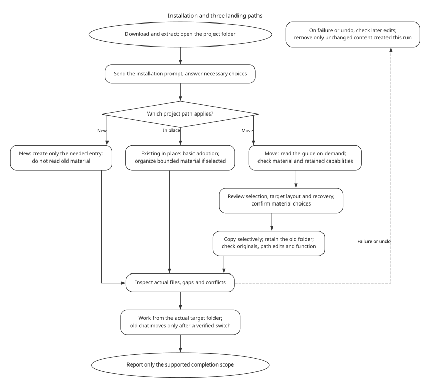

# Project Intelligent Governance System

[简体中文](README.zh-CN.md)

Project Intelligent Governance System is a reusable, documentation-authoritative method for making AI-assisted project folders easier to understand and safer to modify.

It helps an agent inspect a project from local evidence, identify source boundaries, preserve useful project-specific practices, avoid copying private or stale context, and write durable knowledge back to the right place.

## Install into your own folder

This preview includes all three paths. The [preview.6 governance-correction report](docs/governance-correction-verification.md) covers the current rule update. The [preview.5 daily file-protection report](docs/file-preservation-verification.md) and [preview.4 three-flow report](docs/three-flow-verification.md) retain their historical scopes.

1. Open the [release page](https://github.com/Richie521/intelligent-project-governance-system/releases/tag/v0.1.0-preview.6). Under **Assets**, download `governance-v0.1.0-preview.6.zip` and extract it. The download folder is not your project by default.
2. Open Codex in the project folder and start a conversation; for a move, start from the old project and identify its proposed new folder. Open [INSTALL.md](INSTALL.md), copy the entire code block, and send it to Codex. The move path reads the bundled [migration guide](MIGRATE.md) only when selected.
3. Say whether this is a new project, in-place adoption of an existing project, or a move to a separate new folder. Supply the folders and capabilities you have already chosen. If unsure, give what you know; Codex asks the remaining scope decisions together. You can adjust the request as you go. Basic-adoption example:

   ```text
   Target folder: D:\Projects\MyProject
   Use basic adoption without additional features.
   ```

4. A new project gets only the necessary entry. An existing project can use in-place basic adoption or bounded material organization. For a move, review the item choices, target structure, capabilities to retain and recovery plan before copying. Codex reports actual edits, gaps and conflicts; access denial or existing target content stops the affected step. A proposal to edit is not a completed installation.
5. Inspect the resulting files and any explicitly authorized functional checks, then start ordinary work in a conversation attached to that folder. An old in-place conversation first refreshes its current entry. For a move, call an old conversation transferred only after the host actually switches and verifies its working directory; otherwise start a new conversation in the new folder. Before recovery or undo, check for later edits and remove only unchanged content created by this operation, preserving the source. Run project scripts or services only with the current user's explicit authorization. Report only demonstrated outcomes.

<p align="center"><a href="docs/media/installation-guide-en.svg"></a></p>

Basic adoption needs Codex with file access and permission in the target folder. It does not require installing a Skill, Hook, Git, Python, or runtime tools. Existing-material review is optional and bounded. If selected native chats do not yield complete original user messages, use user-provided exports or record a gap. A move selectively copies into a separate new folder and preserves the old project. Historical citations may point back to old sources, while ordinary work must have its needed files and dependencies available from the new folder or explicitly declared. For an old in-place conversation, say: “First read only this project’s current entry, then follow its routes to read the latest decisions and actual state needed in this turn. Do not substitute earlier conversation content for current files or consult personal memory. Reuse text already read in this turn, then continue working.”

[Installation diagram](docs/flowchart.md#预览版安装流程) · [Full installation prompt](INSTALL.md) · [Migration guide](MIGRATE.md) · [Optional advanced features](QUICKSTART.md) · [Preview.4 three-flow verification](docs/three-flow-verification.md)

## Why It Exists

AI coding agents often work inside projects where authority is scattered across chat history, old handoff notes, source files, generated outputs, runtime state, logs, and personal notes. Without a governance layer, the agent may read too broadly, trust stale files, overwrite local conventions, or lose important decisions between sessions.

This project provides a small set of project-local files and reusable methods that let each project remain itself while still benefiting from a shared governance model.

The system offers an optional lightweight global agent bridge. It can help the agent recognize adopted projects and route into local project files, while project-local files preserve each project's real context.

## Design Principles

- Central method, local reality.
- Start from the smallest useful context.
- Treat sessions and memories as evidence, not authority.
- Let the user's latest instruction outrank stale plans and summaries.
- Let the user's latest instruction define the current work; do not activate discontinued planning projections.
- Preserve local strengths before adding new structure.
- Verify governance behavior with real routing and source-boundary probes.
- Log only material governance events that change future state or preserve evidence needed to interpret a result; do not log every conversation.
- Keep private data, logs, credentials, and raw conversations out of the reusable method.

## Visual Overview


See the [editable DOT source](docs/diagrams/system-architecture-en.dot) for this overview and [docs/flowchart.md](docs/flowchart.md) for additional diagrams.

The overview includes optional global guidance and an optional structural Skill; basic adoption through the prompt below does not require installing either or any Hook.

## Repository Layout

```text
docs/
  media/
    governance-flow-en.svg
    governance-flow-zh-CN.svg
  core-model.md
  logging-guide.md
  logging-guide.zh-CN.md
  adoption-guide.md
  verification-guide.md
  global-agent-integration.md
  desensitization-map.md
  flowchart.md
templates/
  global-agents-snippet.md
  AGENTS.md
  docs/
.agents/
  skills/
    project-governance/
examples/
  demo-project/
```

## Delivery Form

The documentation project remains the method authority. The release includes an optional `$project-governance` Codex Skill, local project templates, and an optional lightweight global agent bridge. The Windows transaction runner is optional.

`project-governance` handles structural adoption, migration, source authority, synchronization, mechanism repair, explicitly activated layered diagnosis, and governance verification. A dedicated user command such as `启动分层诊断` is required to enter layered diagnosis; ordinary corrections and governance discussion do not activate it. The planning projection and its standalone Skill are discontinued. Historical diagrams or archived materials that still depict that feature do not describe current capability. A real target-project conversation is useful evidence of local activation, but the optional Windows transaction runner is not a default installation dependency.

MCP, plugin, or app packaging should come later, after local source-of-truth, privacy, registry, and live activation behavior are stable.

## Global Agent Bridge

See [docs/global-agent-integration.md](docs/global-agent-integration.md) for the global instruction layer and why it stays separate from project-local governance files.

## Privacy

This public version uses placeholders and sanitized examples. It should not contain local absolute paths, private project names, credentials, runtime logs, raw conversations, account data, or machine-specific state.

## What We Tested And What Remains Unproven

This preview covers native Windows CLI and WSL adoption, selected existing material, resumed and fresh conversations, repeated operations, and safe handling of blocked targets. Separate Windows desktop checks exercised original content from two selected conversations, old-session refresh, fresh work, and bounded read-only tasks in three existing projects. Acceptance checks inspect actual files, calls and results rather than agent success claims.

Testing exposed and corrected unnecessary reads, redundant draft backups, and a resumed conversation reusing stale configuration. The continuation instruction now explicitly requires current files. Optional transaction commits and recovery, manual diagnosis and scoped synchronization have separate evidence; basic installation does not require these tools. See the [current acceptance record](docs/integration-verification.md) and retained [earlier onboarding results](docs/onboarding-verification.md).

These are bounded preview results, not a guarantee for every folder, permission setup or model. Desktop runs retain host global instructions and plugins and are separate from isolated CLI tests. Real projects received basic adoption checks, not automatic access to their private conversations. macOS, long-term reliability, and comparative token or quality improvements remain unproven. No test uses Hooks.

## License

MIT. See [LICENSE](LICENSE).
