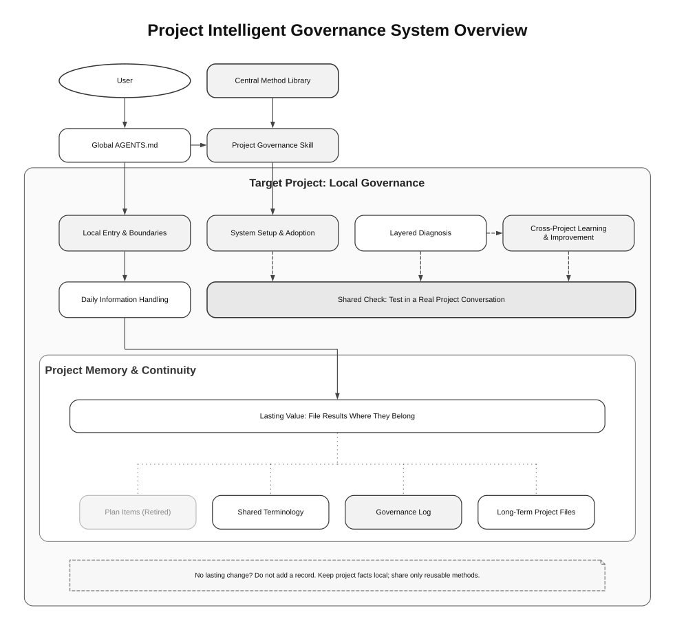

# Project Intelligent Governance System

[简体中文](README.zh-CN.md)

Project Intelligent Governance System is a reusable, documentation-authoritative method for making AI-assisted project folders easier to understand and safer to modify.

It helps an agent inspect a project from local evidence, identify source boundaries, preserve useful project-specific practices, avoid copying private or stale context, and write durable knowledge back to the right place.

## Install into your own folder

1. Open the [release page](https://github.com/richie-liu512/intelligent-project-governance-system/releases/tag/v0.1.0-preview.2). Under **Assets**, download `governance-v0.1.0-preview.2.zip` and extract it. The download folder is not your project by default.
2. Open Codex in your target project folder and start a conversation. Open [INSTALL.md](INSTALL.md), also included in the ZIP, copy the entire code block, and send it to Codex.
3. Supply one or more target folders and your preferences. Choose basic adoption if unsure; Codex will ask together for missing information. For example:

   ```text
   Target folder: D:\Projects\MyProject
   Use basic adoption without additional features.
   ```

4. Codex checks existing rules, creates or extends the local entry, and reports exactly what changed. Adequate rules are reused. Permission problems or conflicts are reported for each affected folder. A proposal to edit is not a completed installation.
5. Start a fresh conversation in the same target folder and give Codex a small ordinary task. An entry file shows that rules were saved; successful work in a fresh conversation shows that they were actually used.

Basic adoption needs Codex with file access and permission to work in your target folder. It does not require installing a Skill, Hook, Git, Python, or runtime tools. Existing business files stay in place. Usually one `AGENTS.md` is created; existing entries are preserved and backed up before editing. Check for subsequent edits before rolling back.

[Full installation prompt](INSTALL.md) · [Optional advanced features](QUICKSTART.md) · [Test record](docs/onboarding-verification.md)

### Installation is a conversation

Stay in the same conversation after sending the prompt. Codex uses information you have already supplied, asks when a target, feature choice, or conflicting rule needs your decision, and continues after your answer. You can add context, correct a misunderstanding, or adjust work that has not happened yet. If an edit has already happened, ask Codex to explain its current state before undoing it; a new instruction does not itself roll back earlier changes.

An illustrative exchange, not a fixed script:

> You: Help me install this using the prompt. I have not chosen a folder yet.
>
> Codex: Which folder or folders should I use? I recommend basic adoption first.
>
> You: Use my project folder with basic features.
>
> Codex: I will check existing rules and make the necessary changes.
>
> You: Keep the rules already in that folder.
>
> Codex: I will preserve them and ask if a conflict needs your decision.

You do not need to approve every step: Codex continues when information is sufficient and asks when a decision is needed. Questions may appear as text or choices depending on the available Codex interface; no extra Hook is required. We tested asking for a target, receiving an answer, and completing installation, not every possible mid-task change.

## Why It Exists

AI coding agents often work inside projects where authority is scattered across chat history, old handoff notes, source files, generated outputs, runtime state, logs, and personal notes. Without a governance layer, the agent may read too broadly, trust stale files, overwrite local conventions, or lose important decisions between sessions.

This project provides a small set of project-local files and reusable methods that let each project remain itself while still benefiting from a shared governance model.

The system also includes a lightweight global agent bridge. The global bridge helps the agent recognize adopted projects and route into local project files, while the project-local files preserve each project's real context.

## Design Principles

- Central method, local reality.
- Start from the smallest useful context.
- Treat sessions and memories as evidence, not authority.
- Let the user's latest instruction outrank stale plans and summaries.
- Let the user's latest instruction define the current work; do not activate discontinued planning projections.
- Preserve local strengths before adding new structure.
- Verify governance behavior with real routing and source-boundary probes.
- Log only material governance events that change future state or preserve evidence needed to interpret a result; do not log every conversation.
- Keep private data, logs, credentials, and raw conversations out of the reusable method.

## Visual Overview



See the [editable DOT source](docs/diagrams/system-architecture-en.dot) for this overview and [docs/flowchart.md](docs/flowchart.md) for additional diagrams.

The overview includes optional global guidance and the structural Skill; basic adoption through the prompt below does not require installing either or any Hook.

## Repository Layout

```text
docs/
  media/
    governance-flow-en.svg
    governance-flow-zh-CN.svg
  core-model.md
  logging-guide.md
  logging-guide.zh-CN.md
  adoption-guide.md
  verification-guide.md
  global-agent-integration.md
  desensitization-map.md
  flowchart.md
templates/
  global-agents-snippet.md
  AGENTS.md
  docs/
.agents/
  skills/
    project-governance/
examples/
  demo-project/
```

## Delivery Form

The documentation project remains the method authority. The public installation includes the `$project-governance` Codex Skill, local project templates, and an optional lightweight global agent bridge. The Windows transaction runner is optional.

`project-governance` handles structural adoption, migration, source authority, synchronization, mechanism repair, explicitly activated layered diagnosis, and governance verification. A dedicated user command such as `启动分层诊断` is required to enter layered diagnosis; ordinary corrections and governance discussion do not activate it. The planning projection and its standalone Skill are discontinued. Historical diagrams or archived materials that still depict that feature do not describe current capability. A real target-project conversation is useful evidence of local activation, but the optional Windows transaction runner is not a default installation dependency.

MCP, plugin, or app packaging should come later, after local source-of-truth, privacy, registry, and live activation behavior are stable.

## Global Agent Bridge

See [docs/global-agent-integration.md](docs/global-agent-integration.md) for the global instruction layer and why it stays separate from project-local governance files.

## Privacy

This public version uses placeholders and sanitized examples. It should not contain local absolute paths, private project names, credentials, runtime logs, raw conversations, account data, or machine-specific state.

## What we tested—and what we have not

This update makes it easier to download the project and ask Codex to adopt it in your own folders. We tested asking for a target and installing, preserving existing rules, repeated installation without duplicate changes, separate outcomes for writable and restricted folders, and ordinary work in a fresh conversation. Earlier failures are retained in the [test report](docs/onboarding-verification.md).

**These installation tests ran in Linux inside Windows (WSL). We have not run this new installation process end to end directly in ordinary Windows, or on a Mac.** Earlier Windows tests checked separate optional tools; they do not establish that this installation process works there.

The current release is `v0.1.0-preview.2`, a preview. Long-term reliability and lower token usage compared with using no governance system have not been established. When a folder cannot be safely adopted, the installer should preserve it and explain why.

## License

MIT. See [LICENSE](LICENSE).
