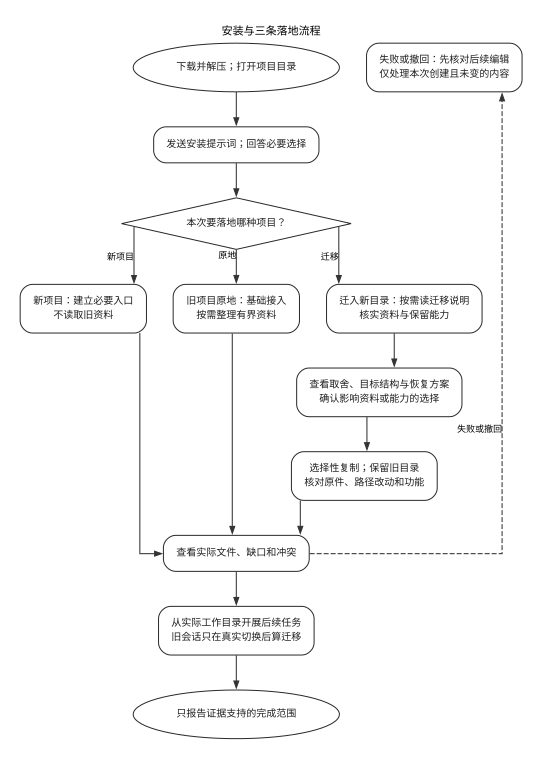

# 项目智能治理系统

[English](README.md)

项目智能治理系统是一套以文档为方法权威的通用治理方法，用来帮助各项目建立适合本地现实的治理规则，让 AI 参与的项目文件夹更容易理解、更安全地修改。

它帮助智能体根据项目本地证据进行分析，识别源文件边界，保留项目已有的有效做法，避免复制隐私或过期上下文，并把真正会影响未来工作的知识写回到正确位置。

## 如何下载安装到自己的文件夹

本预览版包含以下三条路径。[preview.5 日常资料保护报告](docs/file-preservation-verification.zh-CN.md)说明当前行为证据；[preview.4 三条流程报告](docs/three-flow-verification.zh-CN.md)保留历史范围。

1. 打开[下载页面](https://github.com/richie-liu512/intelligent-project-governance-system/releases/tag/v0.1.0-preview.5)，在 **Assets（资源）** 中下载 `governance-v0.1.0-preview.5.zip`，解压到方便找到的位置。不要把下载包目录误当成自己的项目。
2. 打开 Codex，在要接入的项目文件夹中新建对话；迁移时先从旧项目说明源和拟建的新目录。打开[中文安装提示词](INSTALL.zh-CN.md)，复制其中整个代码框的文字，粘贴到对话中发送。迁移分支会按需使用同包的[迁移说明](MIGRATE.zh-CN.md)。
3. 告诉 Codex 是新项目、旧项目原地接入，还是要迁入独立新目录，并提供已确定的文件夹与能力选择。不确定时只说明已知内容；Codex 会集中询问影响范围的必要选择。过程中也可以补充或调整需求。基础接入示例：

   ```text
   目标文件夹：D:\Projects\我的项目
   选择基础接入，暂不启用其他功能。
   ```

4. 新项目只建必要入口；旧项目可在原地做基础接入，或选择整理有界资料。迁移项目先看逐项取舍、目标结构、保留能力及恢复方案，确认影响取舍的选择后才复制。Codex 会报告实际改动、缺口和冲突；没有写入权限或目标已有内容时应明确停在相应步骤。**不要把“准备修改”当成已经安装成功。**
5. 查看目标文件和已获授权的功能检查结果，再从该目录开启新对话做普通任务。原地整理的旧对话先刷新当前入口；迁移时只有宿主确实切换并验证工作目录，才算旧对话迁移续接，否则在新目录开新对话接手。失败恢复或撤回前先核对文件是否后来被修改；只处理本次创建且未变的内容，保留源项目。运行项目脚本或启动服务须当前用户另行明确授权。只报告实际证明的部分。

<p align="center"><a href="docs/media/installation-guide-zh-CN.svg"></a></p>

基础接入不需要另装 Skill、Hook、Git、Python 或运行工具。已有项目资料整理是可选且有界的；选定原生对话无法取得完整用户原文时，可提供导出材料，否则保留缺口。迁移默认选择性复制到独立新目录并保留旧项目；历史出处可指旧资料，正常工作所需文件及依赖必须在新目录可用或明确说明。原地恢复旧对话时，可以发送：“先单独读取本项目当前入口，再按入口读取本轮所需的最新决定和实际状态；不要以旧对话里的内容代替当前文件，不查个人记忆，已在本轮读过的正文直接复用，然后继续工作。”

通常只新增一个 `AGENTS.md`，已有入口时保留原文并先备份；撤回前须确认没有后续改动。

[安装流程图](docs/flowchart.md#预览版安装流程) · [完整安装提示词](INSTALL.zh-CN.md) · [迁移说明](MIGRATE.zh-CN.md) · [可选进阶功能](QUICKSTART.zh-CN.md) · [preview.4 三条流程验收](docs/three-flow-verification.zh-CN.md)

## 为什么需要它

AI 编程智能体经常进入一种上下文很混乱的项目：聊天历史、旧交接稿、源文件、生成结果、运行状态、日志和私人笔记混在一起。如果没有治理层，智能体可能读取过宽、信任过期文件、覆盖本地习惯，或者在下一次会话中丢失重要决策。

这套方法提供一组很小的项目本地文件和可复用流程，让每个项目保留自己的真实工作方式，同时共享一套治理底层逻辑。

这套系统还提供可选的轻量全局智能体桥接规则，用于跨项目识别并进入项目本地文件；项目本地文件保存每个项目自己的真实上下文。

## 设计原则

- 中央方法，本地现实。
- 从最小必要上下文开始。
- 会话和记忆只是证据，不是权威。
- 用户最新表达高于旧计划和助手总结。
- 当前工作只由用户最新表达决定；已停用的计划事项投影不属于当前能力。
- 先保留本地已有优势，再补结构。
- 用真实路由和来源边界问题验证治理是否有效。
- 只记录改变未来状态或需要证据解释结果的重要治理事件，不记录每次对话。
- 不把隐私数据、日志、凭据、原始对话和机器状态写入通用方法。

## 图示总览


这张总览图的[可编辑 DOT 图源](docs/diagrams/system-architecture-zh-CN.dot)；其他专题流程图见 [docs/flowchart.md](docs/flowchart.md)。

总图包含可选全局指导和可选结构治理 Skill；上面的基础接入 prompt 不要求安装它们或任何 Hook。

## 项目结构

```text
docs/
  media/
    governance-flow-en.svg
    governance-flow-zh-CN.svg
  core-model.md
  logging-guide.md
  logging-guide.zh-CN.md
  adoption-guide.md
  verification-guide.md
  global-agent-integration.md
  desensitization-map.md
  flowchart.md
templates/
  global-agents-snippet.md
  AGENTS.md
  docs/
.agents/
  skills/
    project-governance/
examples/
  demo-project/
```

## 交付形态

文档项目继续作为中心方法权威。发布包提供可选的结构治理 Skill `$project-governance`、本地项目模板和可选的轻量全局智能体桥接片段；Windows 治理事务工具也为可选组件。

`project-governance` 处理结构性接入、迁移、来源权威、同步升级、治理机制修复和治理验证。只有用户明确发出“启动分层诊断”等专门命令才进入人工分层诊断；普通纠正和治理讨论不会触发。计划事项投影及其独立 Skill 均已停用。旧图示或归档材料即使保留相关设计，也不代表当前能力。真实目标项目中的对话可用于确认本地激活情况；可选的 Windows 事务工具不是默认安装依赖。

MCP、插件或应用形态应等本地来源权威、隐私边界、项目登记和现场激活行为稳定后再考虑。

## 全局智能体桥接

查看 [docs/global-agent-integration.md](docs/global-agent-integration.md) 理解全局规则层，以及为什么它要和项目本地治理文件分开。

## 隐私边界

公开版只使用占位符和脱敏示例。不应包含本机绝对路径、私人项目名称、凭据、运行日志、原始对话、账号数据或机器状态。

## 我们测过什么，还有什么没测

本版验证了原生 Windows 命令行和 WSL 的接入、指定旧资料整理、新旧会话接手，以及重复操作和权限受阻时的处理。Windows 桌面端另行测试了两个选定聊天的原文读取、旧会话继续、新会话工作和三个已有项目的限定只读任务。原文件、工具调用和结果都经过核对，不以智能体自己说“成功”为准。

测试中发现并修正了不必要读取、多余备份，以及旧会话沿用上一轮配置的问题。旧会话继续指令现在要求核对当前文件。可选事务的提交、失败恢复、人工诊断和限定同步也有独立证据；基本安装不需要启用它们。详见[本版验收记录](docs/integration-verification.zh-CN.md)，此前失败仍保留在[早期安装记录](docs/onboarding-verification.md)。

这是有限条件下验证过的预览版，不保证任何文件夹、权限或模型都能成功。桌面测试保留宿主的全局规则与插件影响，与干净命令行测试分开；真实项目只验证了基础接入，没有自动整理其私人聊天。macOS、长期运行，以及相对不用本系统是否更省 token、效果是否更好，均未证明。所有测试不使用 Hook。

## 许可证

本项目使用 MIT 许可证。见 [LICENSE](LICENSE)。
