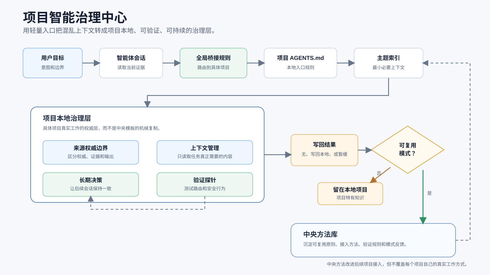

# 项目智能治理中心

[English](README.md)

项目智能治理中心是一套以文档为方法权威的通用治理方法，用来帮助各项目建立适合本地现实的治理规则，让 AI 参与的项目文件夹更容易理解、更安全地修改。

它帮助智能体根据项目本地证据进行分析，识别源文件边界，保留项目已有的有效做法，避免复制隐私或过期上下文，并把真正会影响未来工作的知识写回到正确位置。

## 为什么需要它

AI 编程智能体经常进入一种上下文很混乱的项目：聊天历史、旧交接稿、源文件、生成结果、运行状态、日志和私人笔记混在一起。如果没有治理层，智能体可能读取过宽、信任过期文件、覆盖本地习惯，或者在下一次会话中丢失重要决策。

这套方法提供一组很小的项目本地文件和可复用流程，让每个项目保留自己的真实工作方式，同时共享一套治理底层逻辑。

这套系统还提供可选的轻量全局智能体桥接规则，用于跨项目识别并进入项目本地文件；项目本地文件保存每个项目自己的真实上下文。

## 设计原则

- 中央方法，本地现实。
- 从最小必要上下文开始。
- 会话和记忆只是证据，不是权威。
- 用户最新表达高于旧计划和助手总结。
- 当前工作只由用户最新表达决定；已停用的计划事项投影不属于当前能力。
- 先保留本地已有优势，再补结构。
- 用真实路由和来源边界问题验证治理是否有效。
- 只记录改变未来状态或需要证据解释结果的重要治理事件，不记录每次对话。
- 不把隐私数据、日志、凭据、原始对话和机器状态写入通用方法。

## 图示总览



更多可编辑 Mermaid 源图和补充工作流见 [docs/flowchart.md](docs/flowchart.md)。

## 快速开始

阅读[中文版快速开始](QUICKSTART.zh-CN.md)安装并应用这套方法。

简要流程：

1. 把结构治理 Skill `.agents/skills/project-governance/` 安装到 `$HOME/.agents/skills/`。
2. 需要跨项目识别入口时，按需把 `templates/global-agents-snippet.md` 加入全局智能体规则。
3. 选择新项目、已有项目或迁移项目入口。
4. 确定并固化唯一的治理文件正文权威语言：`zh-CN` 或 `en`；用户主要语言与现有入口冲突时只询问一次。
5. 先用 Skill 做只读接入，不要立即修改文件。
6. 按真实项目适配仍在使用的本地治理机制；计划事项投影已停用。
7. 按[日志与运行证据指南](docs/logging-guide.zh-CN.md)只记录重要治理事件，并把日志、机器档案、决策和当前状态分开。
8. 只把会影响未来路由、来源权威、验证、安全或决策的内容写回长期文件。

## 项目结构

```text
docs/
  media/
    governance-flow-en.svg
    governance-flow-zh-CN.svg
  core-model.md
  logging-guide.md
  logging-guide.zh-CN.md
  adoption-guide.md
  verification-guide.md
  global-agent-integration.md
  desensitization-map.md
  flowchart.md
templates/
  global-agents-snippet.md
  AGENTS.md
  docs/
.agents/
  skills/
    project-governance/
examples/
  demo-project/
```

## 交付形态

文档项目继续作为中心方法权威。公开安装包括结构治理 Skill `$project-governance`、本地项目模板和可选的轻量全局智能体桥接片段；Windows 治理事务工具为可选组件。

`project-governance` 处理结构性接入、迁移、来源权威、同步升级、治理机制修复和治理验证。只有用户明确发出“启动分层诊断”等专门命令才进入人工分层诊断；普通纠正和治理讨论不会触发。计划事项投影及其独立 Skill 均已停用。旧图示或归档材料即使保留相关设计，也不代表当前能力。真实目标项目中的对话可用于确认本地激活情况；可选的 Windows 事务工具不是默认安装依赖。

MCP、插件或应用形态应等本地来源权威、隐私边界、项目登记和现场激活行为稳定后再考虑。

## 全局智能体桥接

查看 [docs/global-agent-integration.md](docs/global-agent-integration.md) 理解全局规则层，以及为什么它要和项目本地治理文件分开。

## 隐私边界

公开版只使用占位符和脱敏示例。不应包含本机绝对路径、私人项目名称、凭据、运行日志、原始对话、账号数据或机器状态。

## 当前状态

`v0.1.0-preview.1`：完成有边界 Windows 验证的预览版。[验收报告](docs/release-verification.md)提供可复跑检查、真实工作结果、token 数据及未验证边界。可选宿主门禁仍属实验性组件。

## 许可证

本项目使用 MIT 许可证。见 [LICENSE](LICENSE)。
