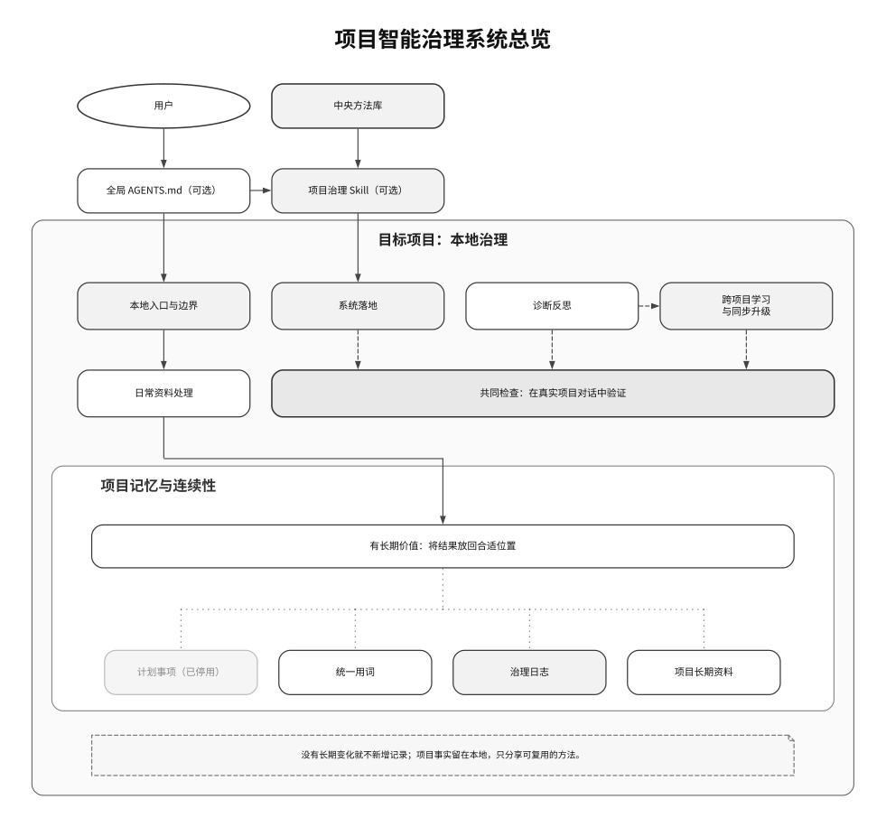
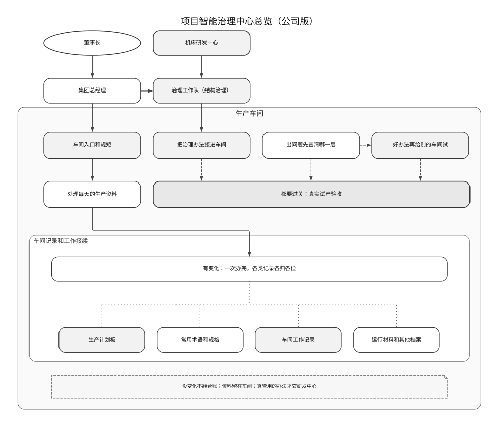
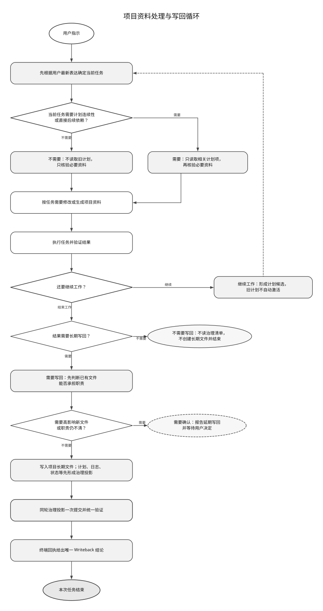
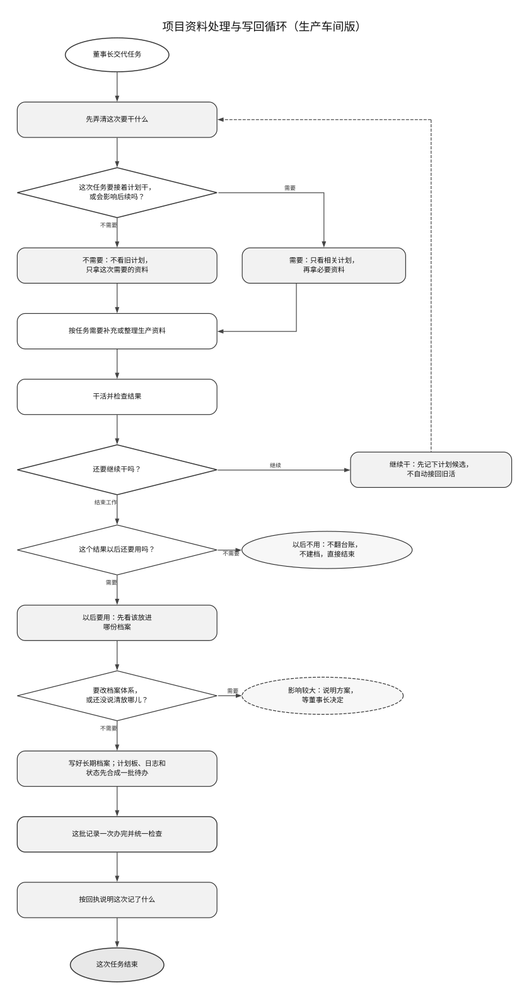
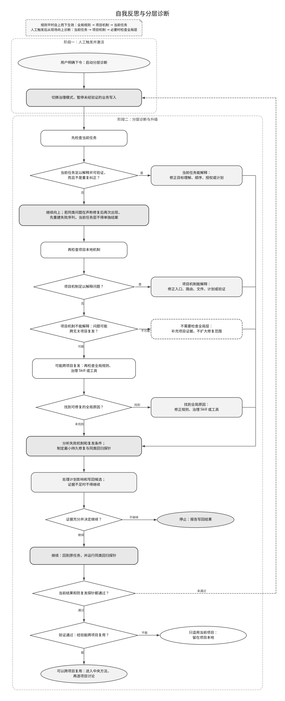
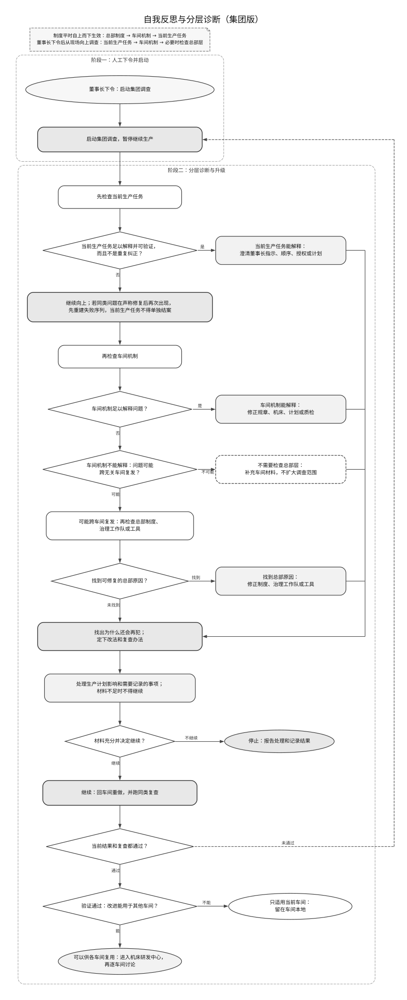
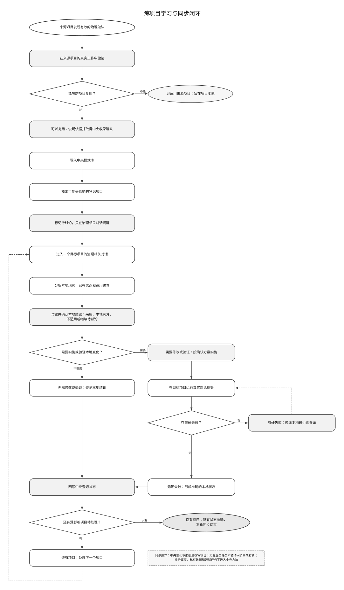
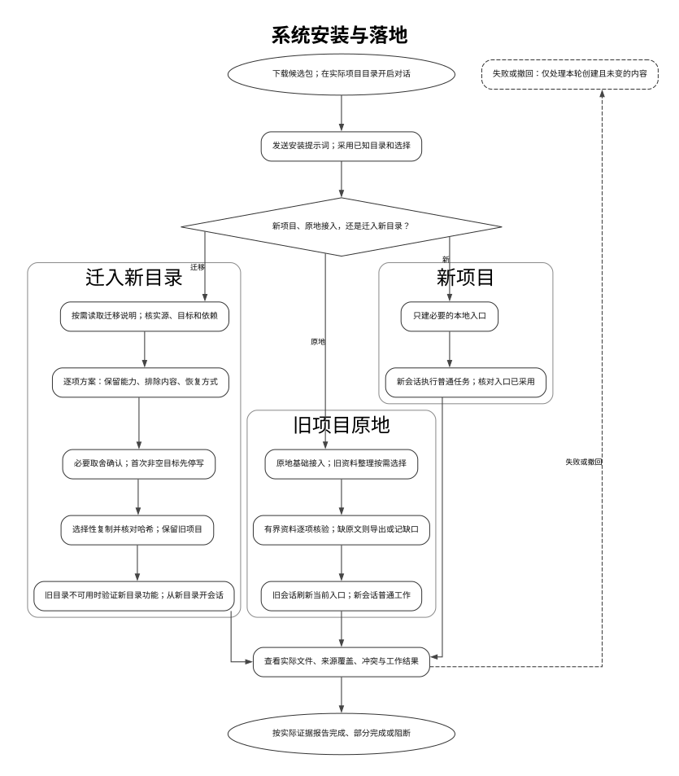
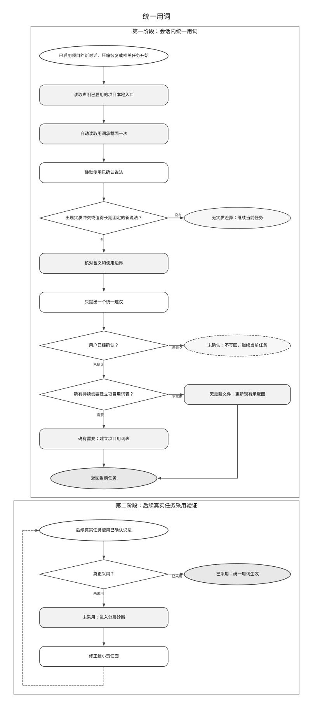
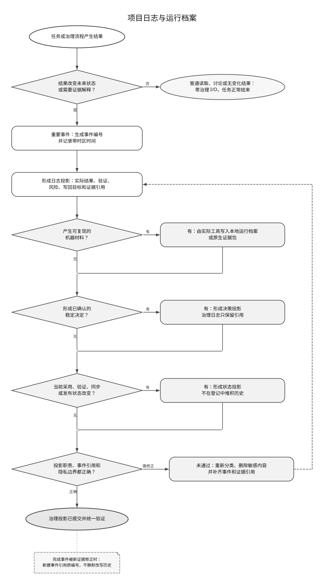

# 流程图

每张中文图在本页单独标记视觉状态。已经获得用户确认的图源和 SVG 作为确认基线冻结；因系统功能、流程语义或必要关系变化而修订的图，必须重新完成内部复审并等待用户确认。

十张中文审查图都使用图形可视化工具（Graphviz）的 `dot` 分层布局。GitHub 页面显示 SVG，仓库保留可编辑 `.dot` 图源。步骤图使用黑白灰和水平、垂直的正交线；判断问题写进菱形，分支出口就近标最短的结果词，避免在线条上堆长句。总览图表达系统关系，不强加步骤图的起止符。系统总览、资料处理和分层诊断分别配有一张结构完全对应的公司拟人版。

## 项目智能治理中心总览

这张图说明全局 `AGENTS.md`、治理 Skill、中央方法项目和目标项目本地治理怎样组成一套系统。普通业务任务从目标项目本地入口开始，不默认读取中央方法项目；治理 Skill 只在接入、迁移、来源权威和其他结构治理工作中按中央方法与项目现实执行。

- [可编辑图源](diagrams/system-architecture-zh-CN.dot)
- [SVG 文件](media/system-architecture-zh-CN.svg)

目标项目内部把项目入口与边界、项目落地与激活、日常资料处理、分层诊断和跨项目同步放在同一个本地治理层。没有治理变化时直接结束，不读取或写入治理文件；有变化时只提交一次治理事务，再把计划事项、统一用词、项目日志、运行档案和其他长期文件按职责归位。中央方法项目同时拥有中央方法职责和自己的本地治理职责，因此也必须真实采用本系统。

本轮把共同验证门槛上移到日常资料处理同层，并让日常资料的写回线路在门槛下方提前转弯，从长期结果归位框上边中点进入。该方案比直接连接更能保持项目记忆区的视觉重心。

状态：内部复审通过，等待用户确认。

## 项目智能治理中心总览（公司版）

这张图把同一套组成关系换成集团公司场景：用户是董事长，全局规则是集团总经理和管理层，治理 Skill 是标准化治理工作队和执行手册，中央方法项目是机床研发中心，目标项目是生产车间。生产资料留在车间，只有验证过的通用改进才反馈研发中心。

- [可编辑图源](diagrams/system-architecture-company-zh-CN.dot)
- [SVG 文件](media/system-architecture-company-zh-CN.svg)

公司版与正式架构图共用节点、连接、分组和阅读顺序，只替换为简短、直白的公司场景标签。

公司版同步采用上移验收门槛和提前转弯的归档线路，标签继续使用简短、直白的车间说法。

状态：内部复审通过，等待用户确认。

## 项目资料处理与写回循环

这张图只说明项目资料怎样按需读取、修改或生成，怎样判断长期保存，以及当前任务确有连续性或直接后续依赖时怎样使用计划事项。它不是完整的“项目本地治理”结构图，也不承担分层诊断或中央方法提炼。

- [可编辑图源](diagrams/project-reading-and-writeback-zh-CN.dot)
- [SVG 文件](media/project-reading-and-writeback-zh-CN.svg)

流程先根据用户最新表达确定当前任务，再判断是否需要计划连续性或直接后续依赖。不需要时不读取旧计划，只核验本轮必要资料；需要时只读取相关计划项，再核验必要资料。还要继续工作时按现行门槛形成计划候选，旧计划不因此自动激活，再从右侧外圈回到当前任务。工作不再继续时，没有长期价值就以零治理 I/O 结束；有长期价值才形成计划、日志、状态或长期文件等治理投影。现有文件不适合时，继续判断能否在当前授权和低影响边界内生成聚焦专题文件；能够生成就同步主题地图，高影响或职责不清就报告延期写回并等待确认。全部治理投影只提交一次并统一验证，终端回执给出唯一 Writeback；投影结果不得再次触发计划、日志或状态写回。项目本地长期文件保存本项目的事实、决定、统一用词、日志和专题知识。

中央方法库不在普通写回循环中。只有分层诊断、模式提炼或同步协议验证某项治理经验能够跨项目复用后，它才进入中央方法，再回到各项目逐个讨论。任何阶段发现问题时，转入下面的独立诊断图。

状态：内部复审通过，等待用户确认。

## 项目资料处理与写回循环（生产车间版）

这张图把同一条资料主线换成生产车间场景：用户是董事长，计划事项是生产计划板，项目本地长期文件是车间档案、规章和日志。车间先弄清这次要干什么，再判断是否需要接着计划干或影响后续；不需要就不看旧计划板，需要就只看相关计划。继续生产时按需记计划板，旧计划不自动接回旧活；不再继续时再判断是否留档。

- [可编辑图源](diagrams/project-reading-and-writeback-company-zh-CN.dot)
- [SVG 文件](media/project-reading-and-writeback-company-zh-CN.svg)

生产车间版不增加或删除任何流程关系，只把计划、治理投影、事务提交和统一验证换成生产计划板、各类记录归位、一批待办一次办完和统一检查等直白说法。

状态：内部复审通过，等待用户确认。

## 自我反思与分层诊断

规则平时按“全局规则 → 项目机制 → 当前任务”生效。普通纠正、任务失焦、资料冲突、治理冲突或写回候选都不会自动开启门禁。只有用户单独发出“启动分层诊断”或同等明确命令时，才切换治理模式并暂停未经验证的业务写入；随后从现场向上诊断，先检查当前任务，再检查项目本地机制，只有问题可能跨无关项目复发时才检查全局规则、治理 Skill 或工具。

- [可编辑图源](diagrams/layered-diagnosis-and-feedback-zh-CN.dot)
- [SVG 文件](media/layered-diagnosis-and-feedback-zh-CN.svg)

一次性问题能够由当前任务充分解释并验证时，可以在当前任务层修正。人工触发后，同类问题在声称修复后再次出现时进入重复纠正升级门槛：先重建失败序列，当前任务层不得单独结案。图中的三条修正支线表示主要根因可能落在不同层，不表示三层都要给建议。诊断只锁定一个主要根因和一个停止层，再汇入防复发分析：说明失败机制和复发条件，确定最小持久修复、复发阻断和同类回归探针；随后再处理计划影响和写回候选，并决定停止或回到原任务验证。只有当前结果和防复发探针都通过，诊断才能完成；验证失败沿外侧线路重新进入治理模式。通过后再判断经验留在本地还是进入中央方法。本图不记录用户长期表达模式。

状态：中文图已确认。

## 自我反思与分层诊断（集团版）

这张图用集团问题调查解释同一套机制：制度平时从总部传到车间和当前生产任务；出现问题时反过来先查当前生产任务，再查车间机制，最后才查总部制度和治理工具。查到足够解释问题的主要原因就停止，不是每一层都提改法。随后先找出为什么还会再犯，定下一套改法和复查办法；当前结果和同类复查都通过后，才能结束调查。能够复用的改进由研发中心吸收，再由各车间分别讨论和试用。

- [可编辑图源](diagrams/layered-diagnosis-and-feedback-company-zh-CN.dot)
- [SVG 文件](media/layered-diagnosis-and-feedback-company-zh-CN.svg)

集团调查版与诊断正式版共用同一套节点和连接关系。

状态：中文图已确认。

## 跨项目学习与同步闭环

这张图说明一个项目中验证过的治理优点，怎样进入中央方法并逐项目落地。来源项目先证明做法真实有效；只适用于本项目的留在本地，能够复用的才经确认进入中央模式库，并在采用项目登记中标记可能受影响的项目。

- [可编辑图源](diagrams/cross-project-learning-and-sync-zh-CN.dot)
- [SVG 文件](media/cross-project-learning-and-sync-zh-CN.svg)

待讨论事项必须回到目标项目的治理相关对话，分析本地现实、保留已有优点并取得修改确认。需要修改或验证时运行真实对话探针，硬失败后修正本地最小责任面并重跑。无论最终采用、保留本地例外、判定不适用还是继续待讨论，都要把真实结果写回中央登记表。中央变化不能批量改写项目，无关业务任务不因待同步事项被打断，项目业务事实和私有数据不进入中央方法。

状态：中文图已确认。

## 安装与项目落地

这张图用于审核用户从 GitHub 下载项目后，如何安装、启用，并分别在新项目、已有项目和迁移项目中完成本地治理落地。

- [可编辑图源](diagrams/adoption-flow-zh-CN.dot)
- [SVG 文件](media/adoption-flow-zh-CN.svg)

安装位置、全局桥接边界和完成标准使用独立说明节点，不与步骤标题挤在同一个节点中。治理 Skill 放入用户目录，确定性治理事务执行器放入系统本地目录。新项目专指没有既有代码、数据或运行状态的从零项目，先明确目标、边界和需求，再提出最小本地治理层；已有资产但首次采用治理系统的仍属于已有项目。新项目、已有项目和迁移项目继续使用三个带边框的大分组，各自完成本地处理后汇入共同第 6 步。第 8 步后的硬失败处理沿垂直主干向下，修正后的重试从左侧外圈返回第 8 步；无硬失败的路径通过一次事务记录非阻断风险、治理事件和真实状态，再进入完成节点；成功出口继续放在判断右侧，不被重试回路包围。完成要求包括文件与运行清单有效、真实对话生效、无硬失败，并且风险、治理事件和采用状态都已由事务准确记录。

状态：内部复审通过，等待用户确认。

## 统一用词

这张图只说明已经由用户确认启用统一用词的项目，怎样读取已确认说法、处理新说法或实质冲突，并验证统一用词真正进入后续文档和表达。未启用项目不进入本图，也不声明、不建表、不运行统一用词探针。

- [可编辑图源](diagrams/terminology-maintenance-zh-CN.dot)
- [SVG 文件](media/terminology-maintenance-zh-CN.svg)

发现新说法或实质冲突后，先核对真实含义和语音输入友好性，再提出一个统一建议。只有用户确认后才更新现有承载面，确有持续需要时才建立项目用词表；写入完成仍不等于生效，必须检查后续项目材料是否实际采用。

状态：中文图已确认。

## 项目日志与运行档案

这张图先判断是否发生了改变未来状态或需要证据解释的重要治理事件。重要事件生成事件编号和带时区时间，并写入实际结果、验证、风险、写回目标和证据引用；普通读取、讨论或没有变化的结果不写治理日志。

- [可编辑图源](diagrams/project-log-and-run-archive-zh-CN.dot)
- [SVG 文件](media/project-log-and-run-archive-zh-CN.svg)

人读治理日志、按需机器运行档案、稳定决策记录和当前状态登记分别承担自己的职责，不能互相替代；计划事项只保存正在推进的主线，不充当历史日志。最终必须检查职责归位、事件引用和隐私边界；检查失败时重新分类、删除敏感内容并准确返回事件写入。检查通过后，全部投影只用一次治理事务提交并统一验证。原始对话、凭据和无关隐私不进入长期记录。

状态：内部复审通过，等待用户确认。

## 当前确认边界

- 系统总览、项目资料处理与写回、分层诊断和跨项目同步已经分图；资料处理图不再冒充完整项目本地治理，也不承载中央方法提炼或完整纠错闭环。
- 自我反思和三层诊断可以在任何阶段由用户人工触发，不因普通纠正或验证失败自动触发；诊断只有在说明复发机制、落实最小持久修复并通过同类回归探针后才能完成。
- 三张公司拟人版只负责帮助理解；对应正式图和专题方法文件仍是功能权威。
- 不需要向每个旧对话发送提示词（prompt）；已有项目和迁移项目只在当前文件不足时读取相关旧对话，或把选定对话分类为长期文件材料、交接提示词、来源索引或排除项。
- “复制了治理文件”不等于完成；必须通过目标项目真实对话的入口、来源冲突、当前计划、分层诊断、写回结果（Writeback）和隐私探针。
- 日常工作中的长期知识优先写回职责合适的现有文件；低风险新专题在已授权执行中可自动建立并同步主题地图，高影响结构变化先确认，讨论阶段只报告延期写回。
- 探针硬失败后必须定位责任层、修正最小责任面，并重跑同一个失败探针。

旧版 Mermaid 草图、功能模块图和把日常治理、三层诊断塞在一起的组合机制图已从本页移除。六张本轮修订图仍等待用户确认，因此尚未满足英文图和 README 图示入口的启动前提。
